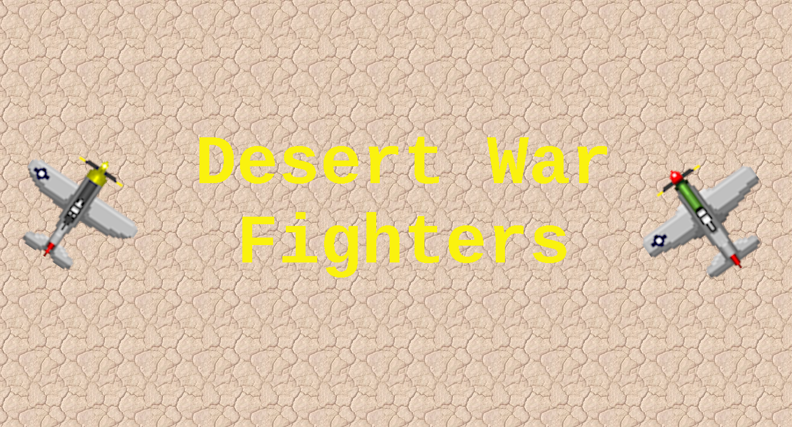
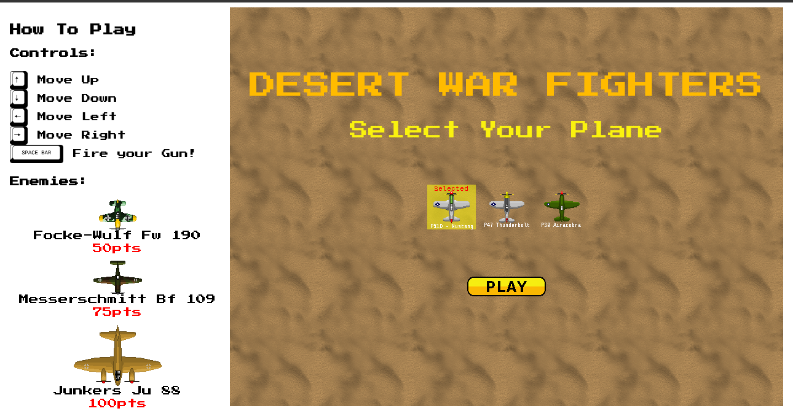
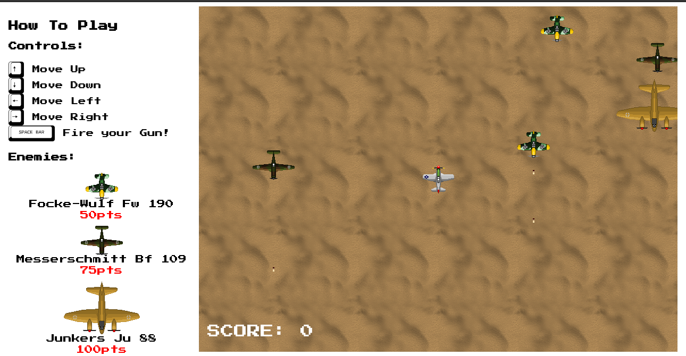
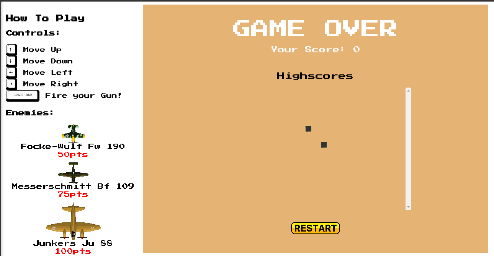
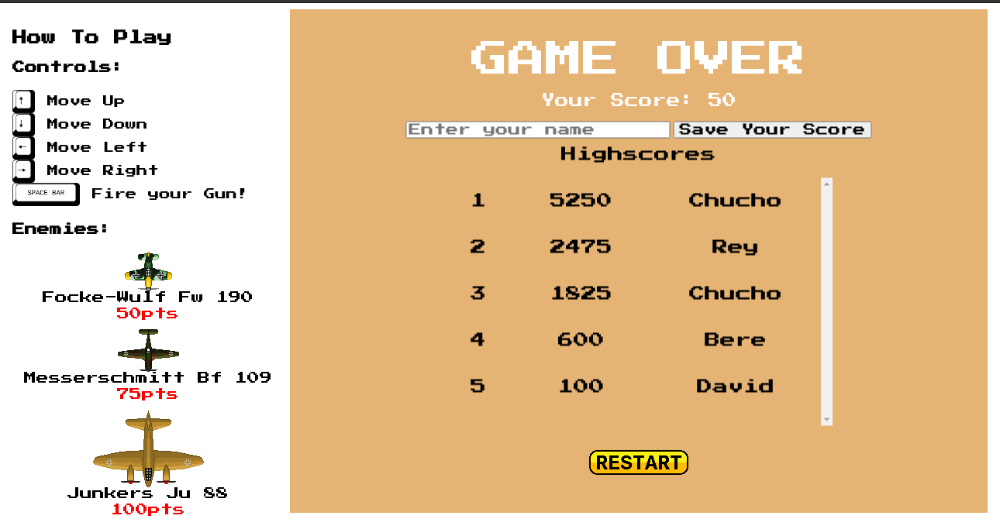

<!-- Badges -->
<p>
  
  <a href="#" target="_blank">
    
  </a>
  <a href="https://twitter.com/redacuve" target="_blank">
    
  </a>
</p>


<!-- Project Header -->
  <p align="center">
    
  <br>
  <h1 align="center">Project Desert War Fighters</h1>
  <p align="center">
  <br>
   <a href="https://github.com/redacuve/Shooter-Game-JS"><strong>Explore the repo »</strong></a>
  <br>
    <a href="https://github.com/redacuve/Shooter-Game-JS/issues">Request Feature</a>
  </p>
  <h2 align="center"><a href="https://desert-war-fighters.netlify.app/"><strong>Live Link!</strong></a></h2>

<!-- TABLE OF CONTENTS -->

## Table of Contents

* [About the Project](#about-the-project)

* [How To Pay](#how-to-play)

* [Live Link](#live-link)

* [Built With](#built-with)

* [Getting Started](#getting-started)

* [How it Works](#how-it-works)

* [Contributing](#contributing)

* [License](#license)

* [Contact](#contact)

* [Acknowledgements](#acknowledgements)

<!-- ABOUT THE PROJECT -->

## About The Project

This is the final project for the Javascript Curriculum.

This project is a game build with the framework Phaser3, I used webpack following the best development practices, using ES6 modules to keep the code clean and organized.

The name of this game is "Desert War Fighters", You can move across the screen and fire up with the spacebar. Your high score can be saved at the end, It connects to an external API to save the high scores.
In order to be able to save your high score you need to score at least 50pts and enter a valid name (it needs to contain at least 1 character), then you can enter your name, it would update the high scores to with the position, the score and the name of the player.

Try to beat the high score. Have fun!

## How To Play

You can select between 3 American fighters from WWII, you can play as Mustang, Thunderbolt, or Airacobra pilot.
You can move the plane with the arrow keys (up left right and down) and fire with spacebar.
Your goal is to be in the first position in the high scoreboard, so as to achieve that you obtain points for every enemy plane you shoot, it can be 50, 75, or 100 points.

### Planes


<p> P51D Mustang </p>


<p> P47 Thunderbolt </p>


<p> P49 Airacobra </p>


<p> Focke-Wulf Fw 190<br> Gives you 50 pts </p>


<p> Messerschmitt Bf 109<br> Gives you 75 pts </p>


<p>Junkers Ju 88<br> Gives you 100 pts </p>

### Screenshots

### Main Menu Scene 


### Main Scene


### Loading Scores Scene


### Gameover Scene


## Live Link

Deployed with Netlify [https://desert-war-fighters.netlify.app/](https://desert-war-fighters.netlify.app/)

## Built With

* [HTML5](https://developer.mozilla.org/en-US/docs/Web/Guide/HTML/HTML5)

* [CSS](https://developer.mozilla.org/en-US/docs/Web/CSS)

* [Javascript](https://developer.mozilla.org/en-US/docs/Web/JavaScript)

* [Phaser3](https://photonstorm.github.io/phaser3-docs/)

* [Webpack](https://webpack.js.org/guides/)

* npm Packages used:
    * [webpack](https://www.npmjs.com/package/webpack)
    * [phaser](https://www.npmjs.com/package/phaser)

<!-- GETTING STARTED -->

## Getting Started

To get a local copy up and running follow these simple steps.

Clone or fork the <a href="https://github.com/redacuve/Shooter-Game-JS">repo</a> [git@github.com:redacuve/Shooter-Game-JS.git]

*note you need have install npm or yarn
* [npm](https://www.npmjs.com/get-npm)
* [yarn](https://classic.yarnpkg.com/en/docs/install)


<!-- HOW IT WORKS -->
## How it Works

This project has many folders, also it has many .js files, these files are located inside /src folder, here, you can find this structure:
 * game.js here contains all we need to create the game
 * /scenes, inside this folder we can find the scenes used for this game
 * /entities, here are the entities used in this game, this includes the planes sprites and the gunshots
 * /api, here you cand find the code for connecting with an eternal API aiming to save your high score

The tests are located inside the /test folder. Inside the /dist folder you cand find the index.htm and inside are the /assets folder, where all sprites and assets for this game can be found.


### Running the code

*   Navigate to the root directory of the project

*   Run this command on your terminal to add all the required packages and dependencies
    ```
    $ npm install
    ```
*   You can test the project with
    ```
    $ npm run test
    ```
*   Also, you can build this webpage for production, this app will be saved inside the /dist folder, here we can see a main.js file, this is a minified file of the previous files inside /src folder.
    ```
    $ npm run build
    ```
*   Now the app is ready, you can open the index.html inside /dist folder with a live server.


<!-- CONTRIBUTING -->

## Contributing

Contributions are what make the open source community such an amazing place to be learn, inspire, and create. Any contributions you make are **greatly appreciated**.

1. Fork the Project

2. Create your Feature Branch (`git checkout -b feature/AmazingFeature`)

3. Commit your Changes (`git commit -m 'Add some AmazingFeature'`)

4. Push to the Branch (`git push origin feature/AmazingFeature`)

5. Open a Pull Request

<!-- LICENSE -->

## License

This project is under the <a href="https://www.gnu.org/licenses/gpl-3.0.html">GNU Public License V3</a>. For more information see <a href="https://github.com/redacuve/Shooter-Game-JS/blob/master/LICENSE">here</a>

<!-- CONTACT -->

## Contact

Rey David Cuevas Vela - [@redacuve](https://twitter.com/redacuve) - [redacuve@gmail.com](mailto:redacuve@gmail.com) -[linkedin.com/in/redacuve/](https://www.linkedin.com/in/redacuve/)

Project Link: [github.com/redacuve/Shooter-Game-JS](https://github.com/redacuve/Shooter-Game-JS) - Tic Tac Toe Project.

<!-- ACKNOWLEDGEMENTS -->

## Acknowledgements

To sudro for his great plane images, the [luftwaffe](https://www.deviantart.com/sudro/art/Luftwaffe-Sprites-WIP-198271841), and [Usaf-Aircraft](https://www.deviantart.com/sudro/art/USAF-Aircraft-Sprites-192379157?comment=1%3A192379157%3A1815763827)

To AirshowStuffVideos for the engines [sound](https://www.youtube.com/watch?v=3Okx0T5vpFc).

To drough for the excelent dunes_simple [tile](https://opengameart.org/content/drought-tiles-pack).

To La musique de jeu vidéo for the [gameover](https://www.youtube.com/watch?v=br3OzOrARh4) sound.

To fupi for the incledible buttons [sounds](https://opengameart.org/content/8bit-menu-highlight).

All of this assets are under the [CC0 1.0](https://creativecommons.org/publicdomain/zero/1.0/) License.


